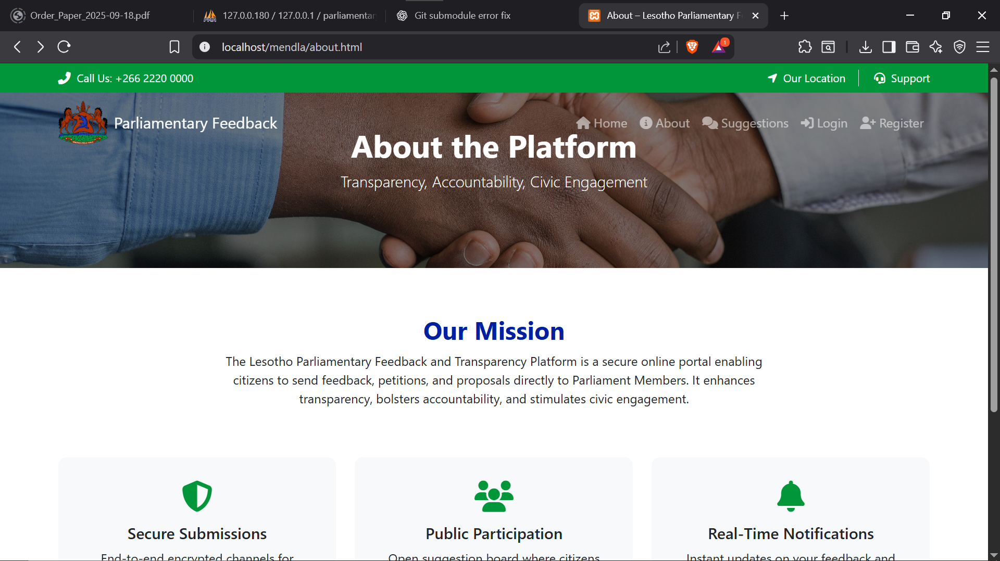

# Parliamentary Feedback Platform

A web-based platform for managing **parliamentary feedback**, petitions, order papers and agenda items for Members of Parliament and citizens.  
Built with PHP (XAMPP stack) and Bootstrap.

 <!-- Replace with an actual screenshot or remove this line -->

---

## ✨ Features

- 📝 **Petitions** – Citizens can submit petitions to Parliament.
- 🗂 **Order Papers & Agenda** – Manage order papers with prayers, tabling of reports, and agenda items (with attachments).
- 👥 **MP Dashboard** – Interface for MPs to view and respond to citizen feedback.
- 👤 **Citizen Portal** – Simple interface for citizens to send suggestions and track responses.
- 📄 **PDF Generation** – Generate and download petitions, reports, and order papers as PDFs.
- 🔒 **Authentication** – Login/Logout system for MPs and citizens.
- 🎨 **Responsive UI** – Built using Bootstrap for mobile-friendly layouts.

---

## 🛠️ Technology Stack

- **Backend:** PHP 8+, MySQL/MariaDB  
- **Frontend:** HTML5, CSS3, Bootstrap 5  
- **PDF:** FPDF library  
- **Server:** XAMPP (Apache, PHP, MySQL)

---

## 📂 Project Structure
mendla/
├── admin/ # Admin dashboard
├── citizen/ # Citizen pages
├── member_of_parlament/ # MP dashboard
├── includes/ # Database connection, functions
├── css/ # Stylesheets
├── images/ # Image assets
├── fpdf186/ # FPDF library for PDF generation
├── about.html
├── footer.html
├── header.html
├── index.php
├── login.html
├── logout.php
├── register.html
├── suggestions.php
├── credentials.txt # Do not commit secrets
└── .gitignore


---

## 🚀 Installation

1. **Clone the repository**  

   ```bash
   git clone https://github.com/wesimosiuoa/Parliamentary-Feedback.git
   cd Parliamentary-Feedback
C:\xampp\htdocs\Parliamentary-Feedback
C:\xampp\htdocs\Parliamentary-Feedback
Import the database

Create a new MySQL database (e.g. parliamentary_feedback).

Import the provided SQL file if included in the repository (or create tables manually).

Configure database credentials

Edit includes/dbcon.inc.php to set your MySQL host, username, password, and database name.

Run the application
http://localhost/Parliamentary-Feedback

## 📝 Usage

Citizens can register and submit petitions or feedback.

MPs can log in via the MP dashboard to view, manage, and respond to citizen input.

Admin users can oversee all data and generate PDF reports.

##🤝 Contributing

Contributions are welcome!

Fork this repository

Create a new branch: git checkout -b feature/YourFeature

Commit your changes: git commit -m "Add some feature"

Push to the branch: git push origin feature/YourFeature

Create a Pull Request

Please make sure your code follows PHP best practices and does not include sensitive credentials.


## 👤 Author

Mosiuoa Wesi
Founder & Director — Wezi Tech Institute of Technology

GitHub: @wesimosiuoa

## 📄 License

This project will be licensed under the MIT License.
MIT License

Copyright (c) 2025 Mosiuoa Wesi

Permission is hereby granted, free of charge, to any person obtaining a copy
of this software and associated documentation files (the "Software"), to deal
in the Software without restriction, including without limitation the rights
to use, copy, modify, merge, publish, distribute, sublicense, and/or sell
copies of the Software, and to permit persons to whom the Software is
furnished to do so, subject to the following conditions:

The above copyright notice and this permission notice shall be included in all
copies or substantial portions of the Software.

THE SOFTWARE IS PROVIDED "AS IS", WITHOUT WARRANTY OF ANY KIND, EXPRESS OR
IMPLIED, INCLUDING BUT NOT LIMITED TO THE WARRANTIES OF MERCHANTABILITY,
FITNESS FOR A PARTICULAR PURPOSE AND NONINFRINGEMENT. IN NO EVENT SHALL THE
AUTHORS OR COPYRIGHT HOLDERS BE LIABLE FOR ANY CLAIM, DAMAGES OR OTHER
LIABILITY, WHETHER IN AN ACTION OF CONTRACT, TORT OR OTHERWISE, ARISING FROM,
OUT OF OR IN CONNECTION WITH THE SOFTWARE OR THE USE OR OTHER DEALINGS IN THE
SOFTWARE.
